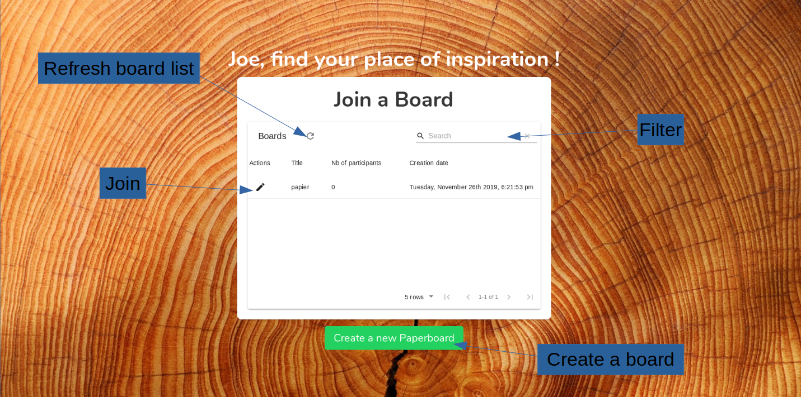
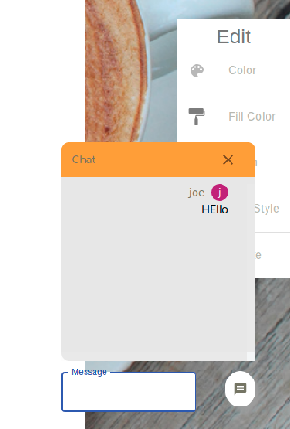
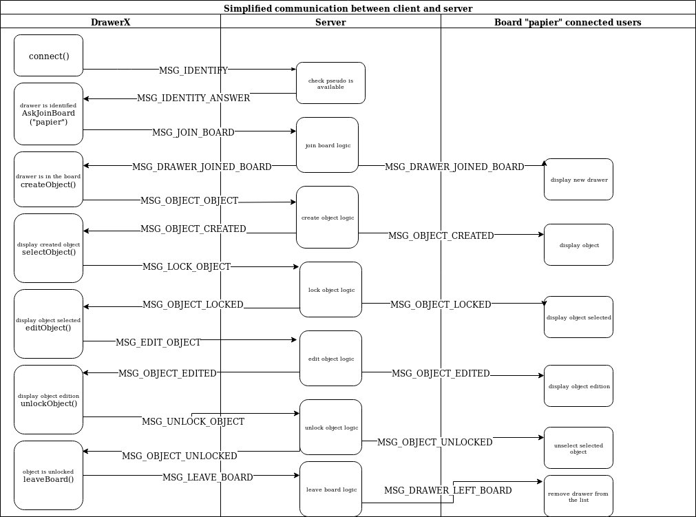
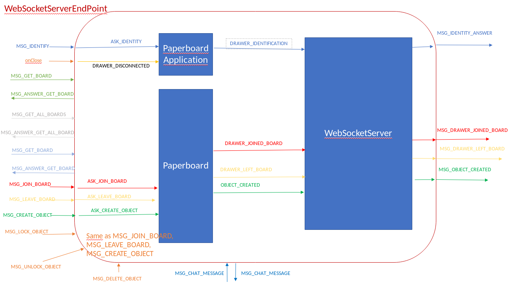

# Just Draw It ! - Server App
Date: 2019 Nov.

Authors : ludovic Descateaux (@mad171) & brieuc loussouarn (@bloussou)

JustDrawIt-Paperboard is a project to pave the basis for a collaborative drawing application. It enable users to create a new Paperboard or join a new Paperboard and sketch it online with many other users.

- [Just Draw It ! - Client App](#just-draw-it----client-app)
  - [User experience](#user-experience)
  - [Setup and Run !](#setup-and-run)
  - [Repository Description](#repository-description)
  - [Architecture and Technical Choices](#architecture-and-technical-choices)
    - [Class Diagram](#class-diagram)
    - [Dependencies](#dependencies)
    - [Workflow and Internal Logic](#workflow-and-internal-logic)

## User experience
1. Simply authenticate with your favorite pseudo
    * 2 users can't have the same pseudo : Find yours !
    * if you get disconnected the pseudo become free again
2. Create or join a board
    * 2 boards can't have the same title
    * When creating you can choose a background image or a background color for your board
    
    
    Lounge page with all the boards
        
    
    Paperboard with one user and a circle selected.

3. Choose a drawing
    * different drawings are available :
        * Hand Writing
        * Line
        * Rectangle
        * Circle
        * Import icon
4. Edit a shape
    * Select a shape by clicking on it
    * Use the edition options panel to choose your options
    * Click on the drawing, different cursors help you to make actions
    
    
    
    Default cursor
    
    
        
    Cursor when you can select a drawing, click to select it
    
    
            
    Cursor when you can move the selected drawing on the board
    
    
            
    Cursor when you can resize the selected drawing
    
4. Chat and see drawers
    * See who is connected
    * Use the chat to communicate with them
    
                
      Chat after clicking on the chat bubble
5. Take a picture
    * NOT DONE YET
6. Leave the board
    * Click on leave board
7. Be the member of a new one
    * Join a new Paperboard
    

## Setup and Run !
Remote backend is hosted on heroku app at https://just-draw-it.herokuapp.com. WARNING : this is a free hosting of the
app with really poor performances. It will crash a lot when drawing handwriting and also icon and image size is
limited to 1.2kb.

- clone or pull the repo
- download the maven dependencies written in the pom.xml file (mvn install)
- start the server with run
- setup your jdk to 11.0.4
- Run the app in your IDE, should listen socket request on localhost:8025

WARNING : 
- if your frontend is not listening on port between 3000 and 3010 you need to add the port to the CORS list
 in `WebSocketServerConfigurator.java`.
 - start the server before the client

## Run the tests
Use your IDE to run the different junit test and understand what they are doing.

## Repository Description

* **src** : Folder containing the code
    * **main/java/com.paperboard/** :  *Package of the application Paperboard*
        * **drawings/** : *Package for Drawing Objects*
            * **Drawing.java** : Abstract class, all the drawings extend this class
            * **shapes/** : *Package containing the shapes (object with line, you can set the color, change line style
             and line width)*
                * Shape : Abstract class, all the shapes extends this class
                * ...
            * DrawingType : enum of the different possible shapes
            * ModificationType : enum of the different editions you can do on Drawings
            * ...
         * *server* : Package containing server code
            * *error* : Package containing customized Exception
            * *events* : Package containing Event management
                * EventType : enum of the different eventType
                * ...
            * *socket* : Package containing server code
                * MessageType : Enum containing 
                * WebsocketServerEndPoint : Entry point for frontend Message
                * ...
            * Paperboard : PaperboardClass
            * PaperboardApplication : main class
            * User : User Class
- **test/java** : contains the junit test
    
## Architecture and Technical Choices

This app is a full websocket app with Tyrus. It has several patterns as Singleton and Observer. It is an object
 oriented program.

### Class Diagram

*drawings* package :

For this we have chose to have two heritage with two abstract class Shape and Drawing. Drawing describe all the
 elements of the paperboard with a unique id.
 
Shape Class define all paperboard objects containing lines we can edit.

You should have a look to the override methods `editDrawing` and `encodeToJsonObject`.

*server* package :

*server* package with *socket* and *events* package :

In this diagram you can see the observer with the Subscriber interface.

### Dependencies
See ./pom.xml
- java 11
- io.projectreactor : have @Nullable
- junit : for the tests
- javax.websocket : websocket serverdepandencies
- org.glassfish.tyrus : websocket server
- javax.json : dependencies to deal with json

### Workflow and Internal Logic

As you can see in the enum MessageType, we have design a set of message to be sure to always use the same string.

Event send from the frontend are handled in WebSocketServerEndPoint, see the onMessage method. In most of the case
internal event are fired (see EventType enum) and handled in WebsocketServer because it's a singleton pattern to
 reduce the number of message sent.
 

Simplified sequence diagram, miss "get" messages.

- The red envelop symbolize webSocketServerEndPointClass.
- Blue squares are classes that register to event
- Outside arrows are socket messages
- inside arrows are events

