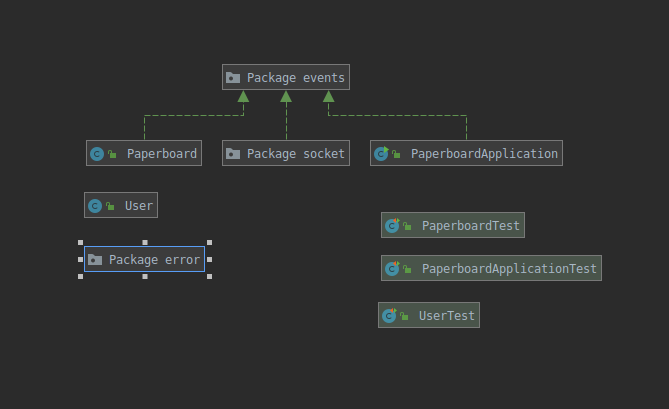

# PaperboardServer
Interactive paperboard websocket server. 

POOA group java5 : Ludovic Descateaux, Brieuc Loussouarn

## Install and run
- clone the repo
- download the maven dependencies written in the pom.xml file
- start the server with run
- setup your jdk to 11.0.4
- Run the app in your IDE, should listen socket request on localhost:8025

## BEFORE USE before november 26th
DO `git pull`

## Run the tests
Use your IDE to run the different junit test and understand what they are doing.

## Project description

### Folders and packages 

* **src** : Folder containing the code
    * **main/java/com.paperboard** :  package paperboard
        * *drawings* : Package containing all the drawings class and a subpackage shape
            * Drawing : Abstract class, all the drawings extends this class
            * *shapes* : Package containing the shapes (object with line, you can set the color, change line style
             and line width)
                * Shape : Abstract class, all the shapes extends this class
                * ...
            * DrawingType : enum of the different possible shapes
            * ModificationType : enum of the different editions you can do on Drawings
            * ...
         * *server* : Package containing server code
            * *error* : Package containing customized Exception
            * *events* : Package containing Event management
                * EventType : enum of the different eventType
                * ...
            * *socket* : Package containing server code
                * MessageType : Enum containing 
                * WebsocketServerEndPoint : Entry point for frontend Message
                * ...
            * Paperboard : PaperboardClass
            * PaperboardApplication : main class
            * User : User Class
- **test/java** : contains the junit test
    
### Architecture and Design

#### Class Diagram

*drawings* package :

For this we have chose to have two heritage with two abstract class Shape and Drawing. Drawing describe all the
 elements of the paperboard with a unique id.
 
Shape Class define all paperboard objects containing lines we can edit.

You should have a look to the override methods `editDrawing` and `encodeToJsonObject`.

*server* package :

*server* package with *socket* and *events* package :

In this diagram you can see the observer pattern detailed bellow.

#### Observer Pattern
// LUDO

#### Socket message logic

As you can see in the enum MessageType, we have design a set of message to be sure to always use the same string.

Event send from the frontend are handled in WebSocketServerEndPoint, see the onMessage method. I most of the case
internal event are fired (see EventType enum) and handled in WebsocketServer because it's a singleton pattern to
 reduce the number of message sent.
 

Flow description : 

// TODO DIAG DE SEQUENCE SUR LES MESSAGES

- WebSocketServerEndPoint.open -> fire : EventType.DRAWER_CONNECTED -> listen by nobody
- WebSocketServerEndPoint.onMessage :
    * MessageType.MSG_IDENTIFY -> fire : EventType.ASK_IDENTITY -> call PaperboardApplication.addUser -> fire EventType
    .DRAWER_IDENTIFICATION -> call WebSocketServerEndPoint.handleEventDrawerIdentification() in WebsocketServer -> send MessageType.MSG_IDENTITY_ANSWER
    * MessageType.MSG_GET_BOARD
    * MessageType.MSG_GET_ALL_BOARDS

### Technical choices

#### Socket with strings 

#### Dependencies
See ./pom.xml
- java 11
- io.projectreactor : have @Nullable
- junit : for the tests
- javax.websocket : websocket serverdepandencies
- org.glassfish.tyrus : websocket server
- javax.json : dependencies to deal with json

## Socket
- join room
- draw
- edit
- Delete
- move ?
- leave

